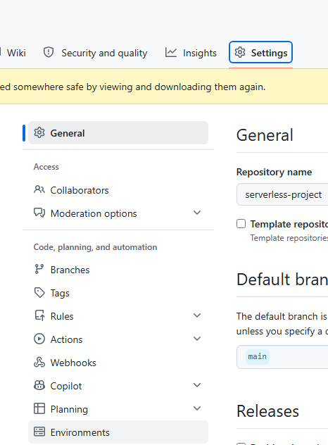

# Serverless Project

## Overview

This project is a serverless system that allows someone to create a user through a create-user api, which is processed and stroed in an S3 bucket to be viewed by a developer. This README outlines step-by-step on how you can get the infrastucture deployed to both `LocalStack` and `AWS`, and go through the whole serverless stack that was used to build this.

## Architectural Diagram


## Prequesitis

If you want to follow along with this project walkthrough you will need to have the following:

- An AWS Account with an IAM user (do not use the root account) - [Create An Account Here](https://aws.amazon.com/free/?trk=ce1f55b8-6da8-4aa2-af36-3f11e9a449ae&sc_channel=ps&ef_id=Cj0KCQjw782_BhDjARIsABTv_JCWZitQyH0tU_lYElDDQ9HdBabDxB-tKSgYDsRiU0N_XqiVVpjvBTUaAmR7EALw_wcB:G:s&s_kwcid=AL!4422!3!433803621002!e!!g!!aws%20sign%20up!9762827897!98496538743&gclid=Cj0KCQjw782_BhDjARIsABTv_JCWZitQyH0tU_lYElDDQ9HdBabDxB-tKSgYDsRiU0N_XqiVVpjvBTUaAmR7EALw_wcB&all-free-tier.sort-by=item.additionalFields.SortRank&all-free-tier.sort-order=asc&awsf.Free%20Tier%20Types=*all&awsf.Free%20Tier%20Categories=*all)

- Terraform - [Install Here](https://developer.hashicorp.com/terraform/tutorials/aws-get-started/install-cli)

- Docker - [Install Here](https://docs.docker.com/desktop/)

- Terraform-local - [Install Here](https://github.com/localstack/terraform-local)

## Directory Structure of Project

```hcl
.
|-- README.md
|-- envs
|   |-- dev
|   |   |-- dev.tfvars
|   |   |-- main.tf
|   |   |-- variables.tf
|   |   `-- versions.tf
|   `-- prod
|       |-- main.tf
|       |-- prod.tfvars
|       |-- variables.tf
|       `-- versions.tf
`-- modules
    |-- api-gw
    |   |-- api-gw.tf
    |   |-- outputs.tf
    |   `-- variables.tf
    |-- cloudwatch
    |   |-- cloudwatch.tf
    |   |-- outputs.tf
    |   `-- variables.tf
    |-- dynamodb
    |   |-- dynamodb.tf
    |   |-- outputs.tf
    |   `-- variables.tf
    |-- eventbridge
    |   |-- eventbridge.tf
    |   |-- outputs.tf
    |   `-- variables.tf
    |-- iam
    |   |-- iam.tf
    |   |-- outputs.tf
    |   `-- variables.tf
    |-- lambda
    |   |-- archive-files
    |   |   |-- dynamodb_function.zip
    |   |   `-- s3_function.zip
    |   |-- functions
    |   |   |-- __pycache__
    |   |   |   |-- dynamodb.cpython-311.pyc
    |   |   |   `-- s3.cpython-311.pyc
    |   |   |-- dynamodb.py
    |   |   `-- s3.py
    |   |-- lambda.tf
    |   |-- outputs.tf
    |   |-- requirements.txt
    |   |-- tests
    |   |   |-- __pycache__
    |   |   |   |-- test_dynamodb.cpython-311.pyc
    |   |   |   `-- test_s3.cpython-311.pyc
    |   |   |-- test_dynamodb.py
    |   |   `-- test_s3.py
    |   `-- variables.tf
    |-- s3
    |   |-- outputs.tf
    |   |-- s3.tf
    |   `-- variables.tf
    `-- sqs
        |-- outputs.tf
        |-- sqs.tf
        `-- variables.tf
```

## How to run LocalStack

To run LocalStack, go ahead and run the following command:

```shell
docker compose up
```

When you have ran that command, access LocalStack through this endpoint `https://app.localstack.cloud/inst/default/resources`. You should be directed to this page:


You now have LocalStack set up.

## How to deploy dev and prod

Now that you LocalStack running it is time to deploy the serverless project to both LocalStack and AWS. Go ahead and run the following commands to deploy the infrastructure to LocalStack first:

```shell
cd envs/dev
```

```shell 
tflocal init
```

```shell
tflocal plan -var-file=dev.tfvars
```

```shell
tflocal apply -var-file=prod.tfvars
```

 Now we will look at how to deploy to Prod. Go ahead and run the following commands:

 ```shell
cd envs/prod
```

```shell
terraform init (make sure you have the bucket created with the exact name in backend.tf)
```

```shell
terraform plan -var-file=prod.tfvars
```

```shell
terraform apply -var-file=prod.tfvars
```

All resources should successfully be deployed to AWS:


You can also deploy to both dev and prod through GitHub Actions (though you won't be able to access LocalStack through GitHub Actions) through manually running the workflows or making file changes to the Terraform files. 

If you are going to deploy it through this way, be sure to set up a GitHub environment called `prod` in settings, Environments and and a protection rule where any workflow job referencing this enviornment needs to have a deployment gate that needs to be reviewed and approved by someone - this deployment gate is applied to both the `apply` and `destroy` workflow jobs:




## The Event flow

Before we go into running this event-driven process, it is important to understand the whole end-to-end event flow from the moment a user is created to an s3 object being created:

- User will send a POST http method request with /create-user to to an API being managed behind an API Gateway.

- The API Gateway will then trigger a Lambda with an event which we extract specific parts like the user that was created which then gets written to a DynamoDB table.

- Once the lambda write the user to the DynamoDB table, this then emits an event that goes to eventbridge pipes that transforms it into an eventbridge event and then sends it to AWS EventBridge.

- The event then hits an event bus matching a rule that then triggers another Lambda function which then puts the event in an S3 Bucket.

## How to trigger event-driven process

Up to this point, you should now have all the necessary infrastrucutre deployed to start getting this entire event-driven flow working end-to-end. Because we are sending POST api requests, you will need to use either curl or Postman for this. In this guide, I will be using Postman. Also note that if you do not have a LocalStack subscription, you won't be able to deploy the eventbridge pipe, which is was you need to be able to forward events from DynamoDB to EventBridge.

So if you are running this in LocalStack, it is going to be a bit different in that you don't actually have the invoke url available to see in API Gateway. Make sure to found out what your Api gateway id is and also enter your own user.

`http://<your apiId>.execute-api.localhost.localstack.cloud:4566/dev/create-user?user=<you user>`

If you are using AWS, simply go to API Gateway and select `stages`. You should see your invoke url:


Go ahead and post the invoke url in Postman. Once you have done that, you should be prompted with the following message:


Once you have seen that successful message, you should see your user in the DynamoDB table:


If you go to S3, you will see an object get generated inside of the `user-data-serverless-project`. This s3 bucket object will contain event data for your user that you created:


## Design decisions

Eventbridge pipes was used in between DynamoDB and eventbridge, so that the raw event that comes from DynamoDB streams can transformed allowing use to shrink the event to only contain fields that we are interested in as opposed to doing this on the Eventbridge level. 

This makes it so that events that EventBridge receives have already been transformed and doesn't require adding in any transformation logic on the eventbridge to transform the event before routing them to consumers as this ideally is something that should be done on the producer side. 

Using pipes also provides with the opprtunity to also add in fields of our own - in this case I added a source and detail-type field, so that the DynamoDB event matches the event pattern in our event bus rule.

On the S3 Lambda, because event routing is happening asyncrhously, it was important to be able to capture failed processed events which I used a dead letter queue for. The dead letter queue is not associated with a source queue, and instead when failed lambda invocations happen after a certain number retries, these failed events get send to the dead letter queue. However, because we are using a single DLQ setup, this makes replying events difficult as I would need to setup another Lambda function to do this.

## Troubleshooting notes

- If you are running into issues with the Lambda Functions check the cloudwatch logs for both of them, or the DLQ for the S3 Lambda function.

- If you are receiving a 400 status code from api this will be due to not passing in the correct path parameter (which is `user`), you did not pass in any path parameters at all or you passed in the wrong path in the url.

- If you run into permissions issues when deploying this via GitHub Actions, make sure your OIDC role that your runner is assuming has the correct permissions. Also make sure that you have an OIDC role created for your runner to asusme.

- If you are using LocalStack and can't deploy the EventBridge pipe, this will be due to not having a LocalStack ultimate subscription. If you do not want to pay for thiis, simply stick to just using AWS.

## Cleaning up

Once you are finished, go ahead and approve the terraform destroy gate to destroy the infrastructure. For LocalStack just run the `tflocal destroy -var-file=dev.tfvars` command.