# Serverless Project

## Overview

This project is a serverless system that allows someone to create a user through a create-user API, which is processed and stored in an S3 bucket to be viewed by a developer. This README outlines, step by step, how you can get the infrastructure deployed to both `LocalStack` and `AWS`, and go through the whole serverless stack that was used to build it.

## Architectural Diagram

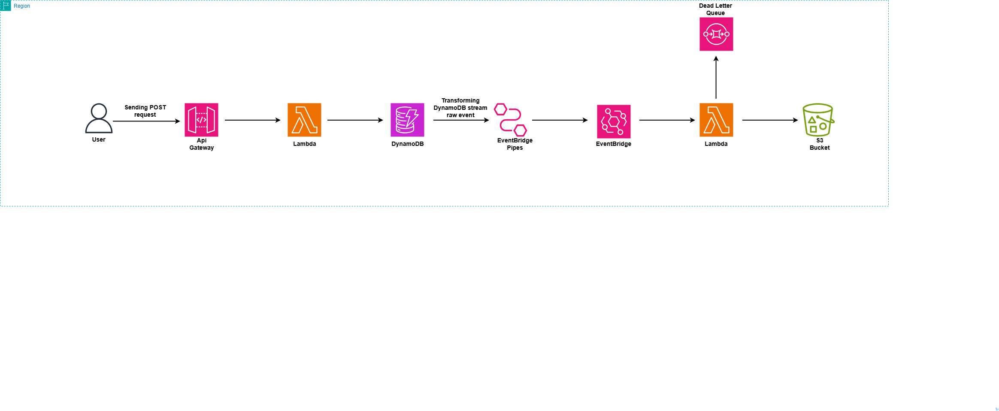

## Prerequisites

If you want to follow along with this project walkthrough, you will need the following:

- An AWS account with an IAM user (do not use the root account) - [Create an account here](https://aws.amazon.com/free/?trk=ce1f55b8-6da8-4aa2-af36-3f11e9a449ae&sc_channel=ps&ef_id=Cj0KCQjw782_BhDjARIsABTv_JCWZitQyH0tU_lYElDDQ9HdBabDxB-tKSgYDsRiU0N_XqiVVpjvBTUaAmR7EALw_wcB:G:s&s_kwcid=AL!4422!3!433803621002!e!!g!!aws%20sign%20up!9762827897!98496538743&gclid=Cj0KCQjw782_BhDjARIsABTv_JCWZitQyH0tU_lYElDDQ9HdBabDxB-tKSgYDsRiU0N_XqiVVpjvBTUaAmR7EALw_wcB&all-free-tier.sort-by=item.additionalFields.SortRank&all-free-tier.sort-order=asc&awsf.Free%20Tier%20Types=*all&awsf.Free%20Tier%20Categories=*all)

- Terraform - [Install Here](https://developer.hashicorp.com/terraform/tutorials/aws-get-started/install-cli)

- Terraform-local - [Install Here](https://github.com/localstack/terraform-local)

- Docker - [Install Here](https://docs.docker.com/desktop/)

## Directory Structure of Project

```hcl
.
|-- README.md
|-- envs
|   |-- dev
|   |   |-- dev.tfvars
|   |   |-- main.tf
|   |   |-- variables.tf
|   |   `-- versions.tf
|   `-- prod
|       |-- main.tf
|       |-- prod.tfvars
|       |-- variables.tf
|       `-- versions.tf
`-- modules
    |-- api-gw
    |   |-- api-gw.tf
    |   |-- outputs.tf
    |   `-- variables.tf
    |-- cloudwatch
    |   |-- cloudwatch.tf
    |   |-- outputs.tf
    |   `-- variables.tf
    |-- dynamodb
    |   |-- dynamodb.tf
    |   |-- outputs.tf
    |   `-- variables.tf
    |-- eventbridge
    |   |-- eventbridge.tf
    |   |-- outputs.tf
    |   `-- variables.tf
    |-- iam
    |   |-- iam.tf
    |   |-- outputs.tf
    |   `-- variables.tf
    |-- lambda
    |   |-- archive-files
    |   |   |-- dynamodb_function.zip
    |   |   `-- s3_function.zip
    |   |-- functions
    |   |   |-- __pycache__
    |   |   |   |-- dynamodb.cpython-311.pyc
    |   |   |   `-- s3.cpython-311.pyc
    |   |   |-- dynamodb.py
    |   |   `-- s3.py
    |   |-- lambda.tf
    |   |-- outputs.tf
    |   |-- requirements.txt
    |   |-- tests
    |   |   |-- __pycache__
    |   |   |   |-- test_dynamodb.cpython-311.pyc
    |   |   |   `-- test_s3.cpython-311.pyc
    |   |   |-- test_dynamodb.py
    |   |   `-- test_s3.py
    |   `-- variables.tf
    |-- s3
    |   |-- outputs.tf
    |   |-- s3.tf
    |   `-- variables.tf
    `-- sqs
        |-- outputs.tf
        |-- sqs.tf
        `-- variables.tf
```

## How to run LocalStack

To run LocalStack, go ahead and run the following command:

```shell
docker compose up
```

Once you have run that command, access LocalStack through this endpoint: `https://app.localstack.cloud/inst/default/resources`. You should be directed to this page:

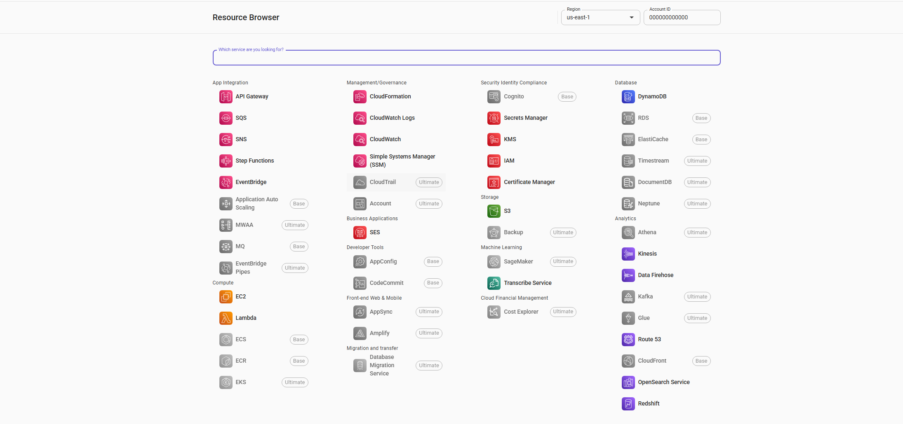

You now have LocalStack set up.

## How to deploy dev and prod

Now that you have LocalStack running, it is time to deploy the serverless project to both LocalStack and AWS. Run the following commands to deploy the infrastructure to LocalStack first:

```shell
cd envs/dev
```

```shell 
tflocal init
```

```shell
tflocal plan -var-file=dev.tfvars
```

```shell
tflocal apply -var-file=prod.tfvars
```

Now we will look at how to deploy to prod. Run the following commands:

 ```shell
cd envs/prod
```

```shell
terraform init
```

```shell
terraform plan -var-file=prod.tfvars
```

```shell
terraform apply -var-file=prod.tfvars
```

All resources should be successfully deployed to AWS:

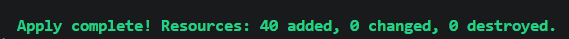

You can also deploy to both dev and prod through GitHub Actions (though you will not be able to access LocalStack through GitHub Actions) by manually running the workflows or making file changes to the Terraform files.

If you are going to deploy it this way, be sure to set up a GitHub environment called `prod` in settings under Environments, and add a protection rule so that any workflow job referencing this environment needs a deployment gate that must be reviewed and approved by someone. This deployment gate is applied to both the `apply` and `destroy` workflow jobs:

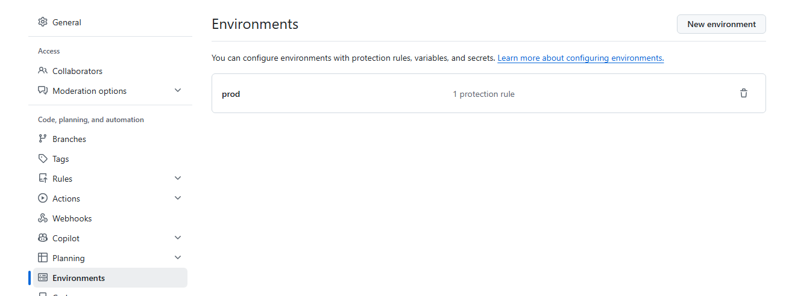

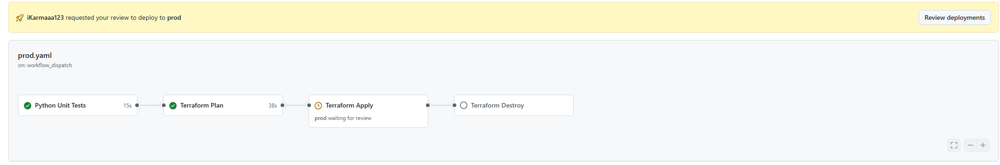

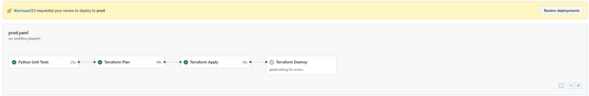

## The event flow

Before we go into running this event-driven process, it is important to understand the end-to-end flow from the moment a user is created to an S3 object being created:

- The user sends a POST HTTP request to `/create-user` on an API managed behind an API Gateway.

- API Gateway then triggers a Lambda with an event. We extract specific parts, such as the created user, and write them to a DynamoDB table.

- Once the Lambda writes the user to the DynamoDB table, it emits an event that goes to EventBridge Pipes, which transforms it into an EventBridge event and then sends it to AWS EventBridge.

- The event then hits an event bus with a matching rule, which triggers another Lambda function that puts the event in an S3 bucket.

## How to trigger the event-driven process

Up to this point, you should now have all the necessary infrastructure deployed to get this entire event-driven flow working end to end. Because we are sending POST API requests, you will need to use either curl or Postman for this. In this guide, I will be using Postman. Also note that if you do not have a LocalStack subscription, you will not be able to deploy the EventBridge pipe, which is what you need to forward events from DynamoDB to EventBridge.

So if you are running this in LocalStack, it is going to be a bit different because you do not actually have the invoke URL available in API Gateway. Make sure you find out what your API Gateway ID is and enter your own user. Also, set the path to `/dev/create-user` when on LocalStack.

`http://<your apiId>.execute-api.localhost.localstack.cloud:4566/dev/create-user?user=<you user>`

If you are using AWS, simply go to API Gateway and select `stages`. You should see your invoke URL:

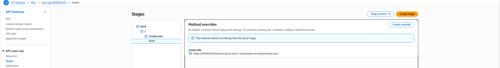

Go ahead and post the invoke URL in Postman. Once you have done that, you should see the following message:

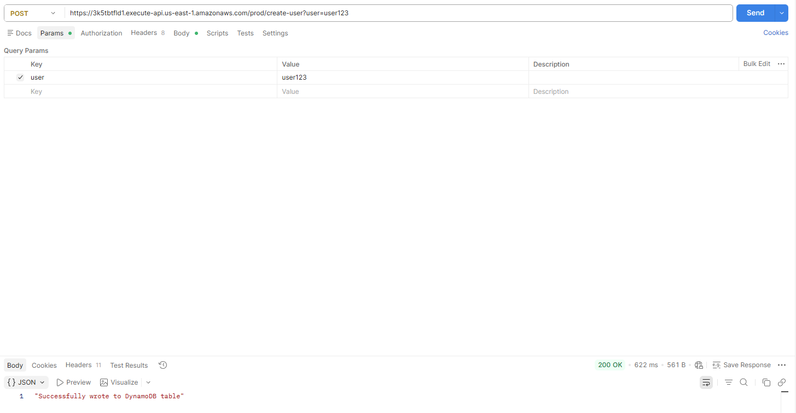

Once you have seen that successful message, you should see your user in the DynamoDB table:

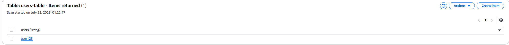

If you go to S3, you will see an object generated inside the `user-data-serverless-project` bucket. This S3 bucket object will contain the event data for the user you created:

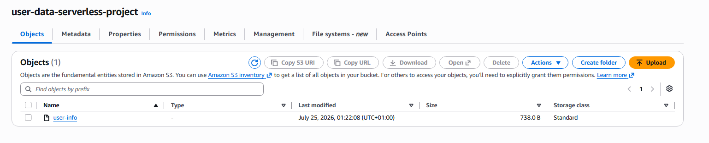

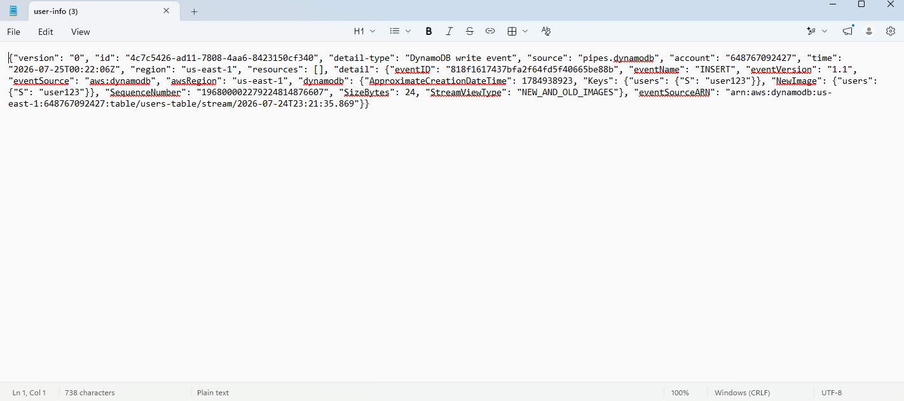

## Design decisions

EventBridge Pipes was used between DynamoDB and EventBridge, so that the raw event that comes from DynamoDB streams can be transformed, allowing us to shrink the event down to only the fields we are interested in, rather than doing this at the EventBridge level.

This means the events that EventBridge receives have already been transformed, and it does not require any extra transformation logic on the EventBridge side before routing them to consumers. Ideally, this kind of work should happen on the producer side.

Using Pipes also gives us the opportunity to add fields of our own. In this case, I added a source and detail-type field so that the DynamoDB event matches the event pattern in our event bus rule.

On the S3 Lambda, because event routing is happening asynchronously, it was important to be able to capture failed processed events, which I did with a dead letter queue. The dead letter queue is not associated with a source queue, and instead, when failed Lambda invocations happen after a certain number of retries, these failed events get sent to the dead letter queue. However, because we are using a single DLQ setup, this makes replaying events difficult, as I would need to set up another Lambda function to do this.

## Troubleshooting notes

- If you are running into issues with the Lambda functions, check the CloudWatch logs for both of them, or the DLQ for the S3 Lambda function.

- If you are receiving a 400 status code from the API, this will be due to not passing in the correct path parameter (which is `user`), not passing in any path parameters at all, or passing in the wrong path in the URL.

- If you run into permissions issues when deploying this via GitHub Actions, make sure that the OIDC role your runner is assuming has the correct permissions. Also make sure that you have an OIDC role created for your runner to assume.

- If you are using LocalStack and cannot deploy the EventBridge pipe, this will be due to not having a LocalStack Ultimate subscription. If you do not want to pay for this, simply stick to using AWS.

## Cleaning up

Once you are finished, go ahead and approve the `Terraform destroy` gate in the `prod` workflow to destroy the infrastructure. For LocalStack, just run the `tflocal destroy -var-file=dev.tfvars` command.